 
### Jocelyn Rodriguez Ponce 18100229 <br><br>
# **EJERCICIOS UNIDAD 1**


----------------
  ## **Ejercicios de creación y actualización de repositorios** <br> <br>

-------------------

## Ejercicio 1 <br>
Configurar Git definiendo el nombre del usuario, el correo electrónico y activar el coloreado de la salida. Mostrar la configuración final.

```
$ git config --global user.name "Nombre usuario Git"

$ git config --global user.email "Correo electronico"

$ git config --global color.ui auto

$ git config --list 
```

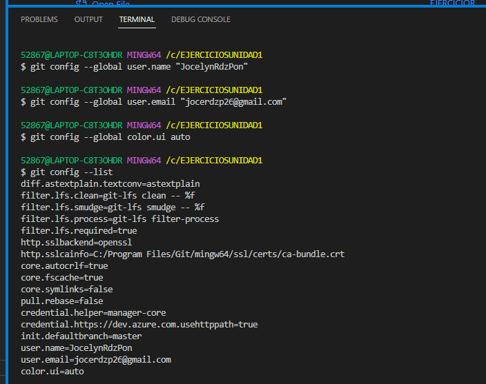

## Ejercicio 2 <br>

Crear un repositorio nuevo con el nombre libro y mostrar su contenido.
```
$ mkdir libro
$ cd libro
$ git init

```
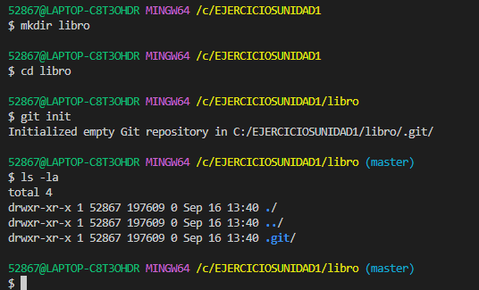

## Ejercicio 3 <br>

Comprobar el estado del repositorio.

1. Comprobar el estado del repositorio.
2. Crear un fichero **indice.txt** con el siguiente contenido:
   >Capítulo 1: Introducción a Git<br>
   >Capítulo 2: Flujo de trabajo básico<br>
   >Capítulo 3: Repositorios remotos<br>
3. Añadir el fichero a la zona de intercambio temporal.

4. Volver a comprobar una vez más el estado del repositorio.

>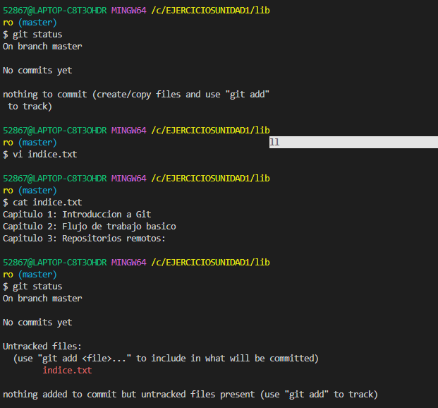

>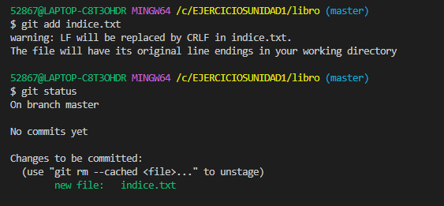


## Ejercicio 4 <br>

Realizar un commit de los últimos cambios con el mensaje “Añadido índice del libro.” y ver el estado del repositorio.
```
$ git commit -m "Añadido índice del libro."
$ git status
```
>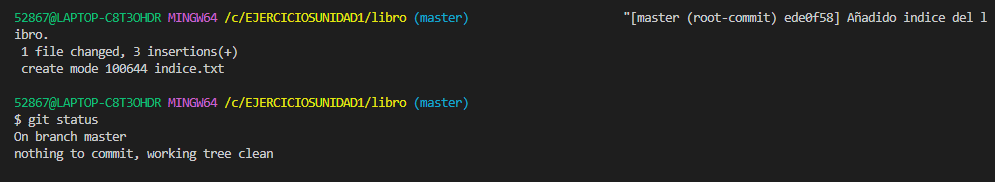<br><br>


## Ejercicio 5 <br>

1. Cambiar el fichero **indice.txt** para que contenga lo siguiente:
   >Capítulo 1: Introducción a Git <br>
   >Capítulo 2: Flujo de trabajo básico<br>
   >Capítulo 3: Gestión de ramas<br>
   >Capítulo 4: Repositorios remotos<br>

    Se realizan las modificaciones con este comando y se visualizan con el comando *cat* 

    ```
    $ vi indice.tx

    $ cat indice.txt
    Capítulo 1: Introducción a Git 
    Capítulo 2: Flujo de trabajo básico
    Capítulo 3: Gestión de ramas
    Capítulo 4: Repositorios remotos
    ```
2. Mostrar los cambios con respecto a la última versión guardada en el repositorio.
   ```
   $ git diff 
   ```

3. Hacer un commit de los cambios con el mensaje “Añadido capítulo 3 sobre gestión de ramas”.
   
    ``` 
    $ git add .
    $ git commit -m "Añadido capítulo 3 sobre gestión de ramas" 
    ``` 

>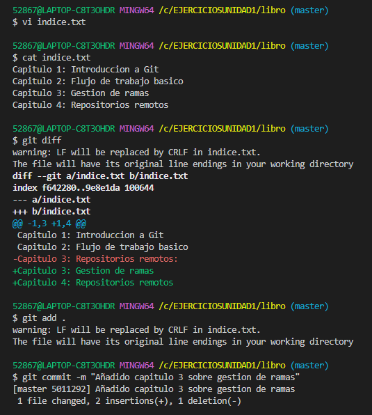<br><br>

## Ejercicio 6 <br>

1. Mostrar los cambios de la última versión del repositorio con respecto a la anterior.
``` 
$ git show

``` 

2. Cambiar el mensaje del último commit por “Añadido capítulo 3 sobre gestión de ramas al índice.”

``` 
$ git commit --amend -m "Añadido capítulo 3 sobre gestión de ramas al índice."

``` 

3. Volver a mostrar los últimos cambios del repositorio.

```
$ git show

``` 
>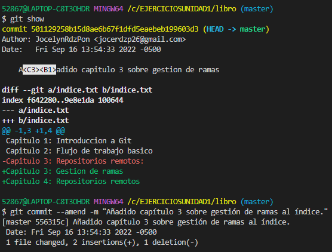<br><br>

>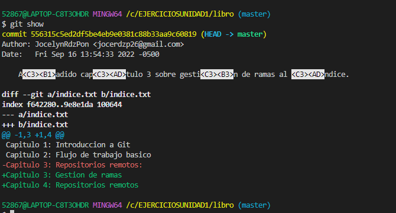<br><br>


<br><br>
  ## **Ejercicios de manejo del historial de cambios** <br> <br>

-------------------

## Ejercicio 1 <br>

1. Mostrar el historial de cambios del repositorio.
    ``` 
    $ git log
    ``` 
2. Crear la carpeta capitulos y crear dentro de ella el fichero capitulo1.txt con el siguiente texto.
   >Git es un sistema de control de versiones ideado por Linus Torvalds.

   ``` 
    $ mkdir capitulos

    $ vi capitulos/capitulo1.txt

    $ cat capitulos/capitulo1.txt

   ``` 

3. Añadir los cambios a la zona de intercambio temporal.
   
     ``` 
     $ git add .
     ``` 
4. Hacer un commit de los cambios con el mensaje “Añadido capítulo 1.”
     ```
     $ git commit -m "Añadido capítulo 1."   
     ``` 
   
5. Volver a mostrar el historial de cambios del repositorio.
     ```
     $ git log   
    
     ``` 
>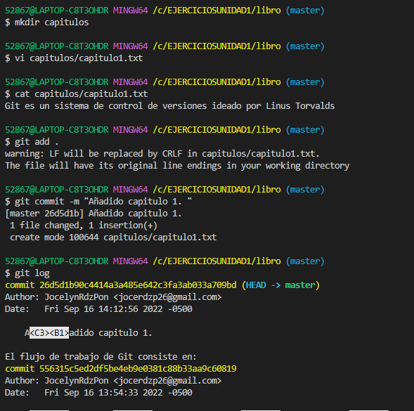<br><br>

---------

## Ejercicio 2
------------

1. Crear el fichero capitulo2.txt en la carpeta capitulos con el siguiente texto.
    >El flujo de trabajo básico con Git consiste en:<br>
    1- Hacer cambios en el repositorio.<br>
    2- Añadir los cambios a la zona de intercambio temporal. <br>
    3- Hacer un commit de los cambios.<br>

    ``` 
    $ vi capitulos/capitulo2.txt

    $ cat capitulos/capitulo2.txt
    El flujo de trabajo básico con Git consiste en: 1- Hacer cambios en el repositorio. 
    2- Añadir los cambios a la zona de intercambio temporal. 
    3- Hacer un commit de los cambios.
    ```

2. Añadir los cambios a la zona de intercambio temporal.
    ``` 
    $ git add .
    ```
3. Hacer un commit de los cambios con el mensaje “Añadido capítulo 2.”
   ``` 
    $ git commit -m "Añadido capitulo 2"
    ```
4. Mostrar las diferencias entre la última versión y dos versiones anteriores.

>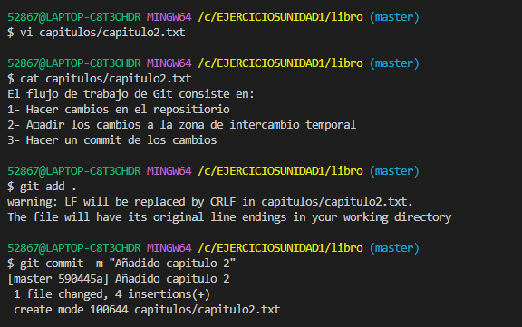<br><br>

>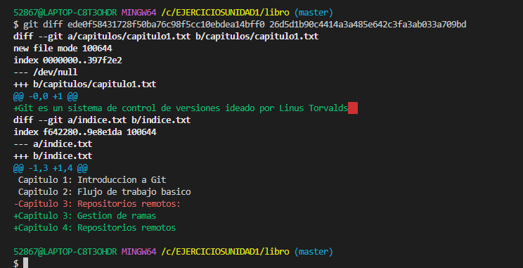<br><br>

---------

## Ejercicio 3
------------

1. Crear el fichero capitulo3.txt en la carpeta capitulos con el siguiente texto.
    >Git permite la creación de ramas lo que permite tener distintas versiones del mismo proyecto y trabajar de manera simultanea en ellas.

    ```
    $ vi capitulos/capitulo3.txt

    $ cat capitulos/capitulo3.txt
    Git permite la creación de ramas lo que permite tener distintas versiones del mismo proyecto y trabajar de manera simultanea en ellas.

    ```

2. Añadir los cambios a la zona de intercambio temporal.

    ```
    $ git add .
    ```

3. Hacer un commit de los cambios con el mensaje “Añadido capítulo 3.”
    ```
    $ git commit -m "Añadido capitulo 3"
    ```

4. Mostrar las diferencias entre la primera y la última versión del repositorio.


>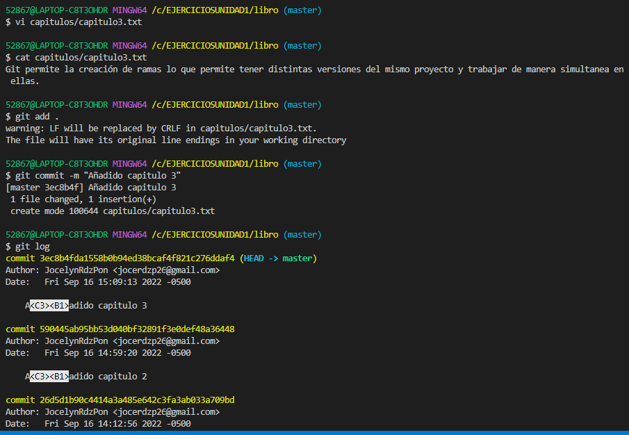<br><br>

>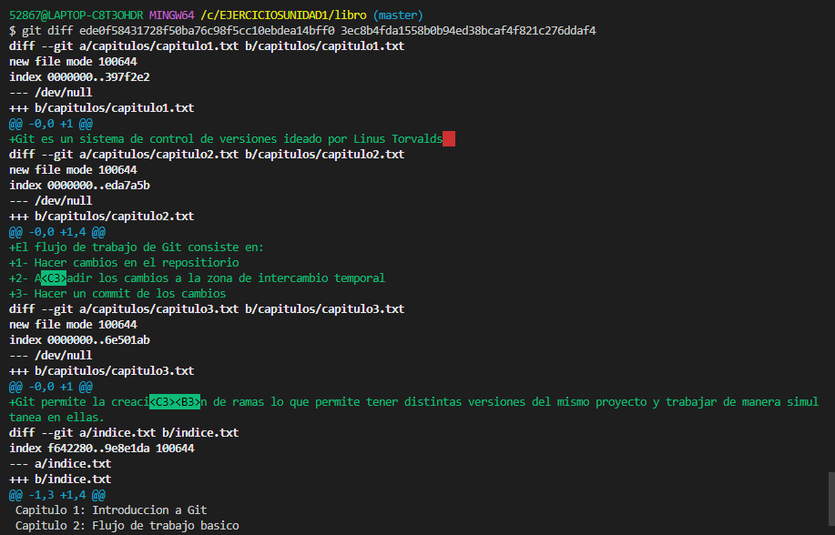<br><br>


----------------
## Ejercicio 4
---------------
1. Añadir al final del fichero indice.txt la siguiente línea:

    >Capítulo 5: Conceptos avanzados

    ```
        $ vi indice.txt

        $ cat indice.txt
        Capítulo 1: Introducción a Git
        Capítulo 2: Flujo de trabajo básico
        Capítulo 3: Gestión de ramas
        Capítulo 4: Repositorios remotos
        Capítulo 5: Conceptos avanzados
    ```

1. Añadir los cambios a la zona de intercambio temporal.
    ```
    $ git add .
    ```

2. Hacer un commit de los cambios con el mensaje “Añadido capítulo 5 al índice.”.
    ```
    $ git commit -m "Añadido capitulo 5 al indice .
    ```

3. Mostrar quién ha hecho cambios sobre el fichero indice.txt.

    ```
        $ git annotate indice.txt
    ```


>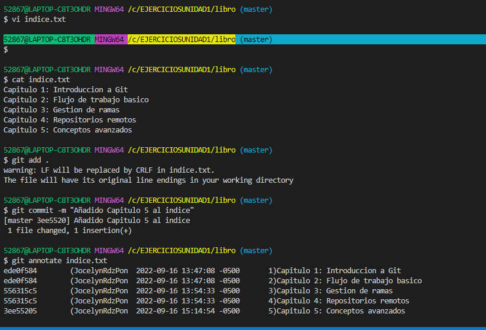<br><br>

--------------------
<br><br>
  ## **Ejercicios de deshacer cambios** <br> <br>

-------------------

## Ejercicio 1 <br>

1. Eliminar la última línea del fichero **indice.txt** y guardarlo.

```
 $ vi indice.txt

 $ cat indice.txt
    Capítulo 1: Introducción a Git
    Capítulo 2: Flujo de trabajo básico
    Capítulo 3: Gestión de ramas
    Capítulo 4: Repositorios remotos

```
2. Comprobar el estado del repositorio.
```
  $ git status
```
3. Deshacer los cambios realizados en el fichero indice.txt para volver a la versión anterior del fichero.

```
  $ git checkout indice.txt
```

4. Volver a comprobar el estado del repositorio.

```
  $ cat indice.txt 
    Capítulo 1: Introducción a Git
    Capítulo 2: Flujo de trabajo básico
    Capítulo 3: Gestión de ramas
    Capítulo 4: Repositorios remotos
    Capitulo 5: Conceptos avanzados
```

>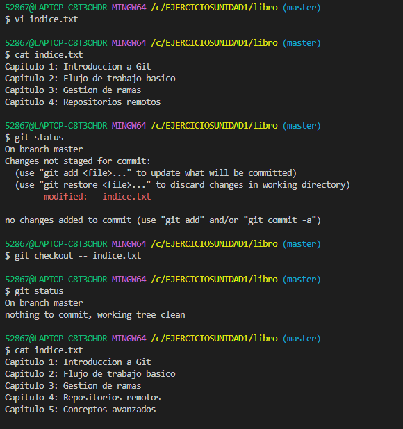<br><br>

---------

## Ejercicio 2
------------

1. Eliminar la última línea del fichero indice.txt y guardarlo.

```
 $ vi indice.txt

 $ cat indice.txt
    Capítulo 1: Introducción a Git
    Capítulo 2: Flujo de trabajo básico
    Capítulo 3: Gestión de ramas
    Capítulo 4: Repositorios remotos
```

2. Añadir los cambios a la zona de intercambio temporal.

```
 $ git add .
```

3. Comprobar de nuevo el estado del repositorio.
```
 $ git status 
```

2. Quitar los cambios de la zona de intercambio temporal, pero mantenerlos en el directorio de trabajo.

```
 $ git reset indice.txt
```

3. Comprobar de nuevo el estado del repositorio.

```
 $ git status
```
4. Deshacer los cambios realizados en el fichero indice.txt para volver a la versión anterior del fichero.

```
 $ git checkout --indice.txt
```
5. Volver a comprobar el estado del repositorio.

```
 $ git status
```

>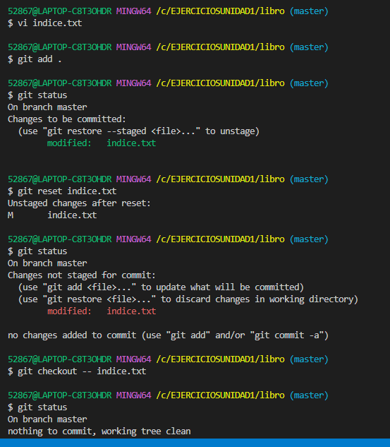<br><br>

---------

## Ejercicio 3
------------

1. Eliminar la última línea del fichero indice.txt y guardarlo.

```
 $ vi indice.txt

 $ cat indice.txt
    Capítulo 1: Introducción a Git
    Capítulo 2: Flujo de trabajo básico
    Capítulo 3: Gestión de ramas
    Capítulo 4: Repositorios remotos
```

2. Eliminar el fichero capitulos/capitulo3.txt.

```
 $ rm capitulos/capitulo3.txt
```
3. Añadir un fichero nuevo captitulos/capitulo4.txt vacío.

```
 $ vi capitulos7capitulo4.txt
```
4. Añadir los cambios a la zona de intercambio temporal.

```
 $ git add .
```
5. Comprobar de nuevo el estado del repositorio.
```
 $ git status
```
6. Quitar los cambios de la zona de intercambio temporal, pero mantenerlos en el directorio de trabajo.
```
 $ git reset
```
7. Comprobar de nuevo el estado del repositorio.
```
 $ git status
```
8. Deshacer los cambios realizados para volver a la versión del repositorio.
```
 $ git checkout -- .
```
9. Volver a comprobar el estado del repositorio.
```
 $ git status
```

>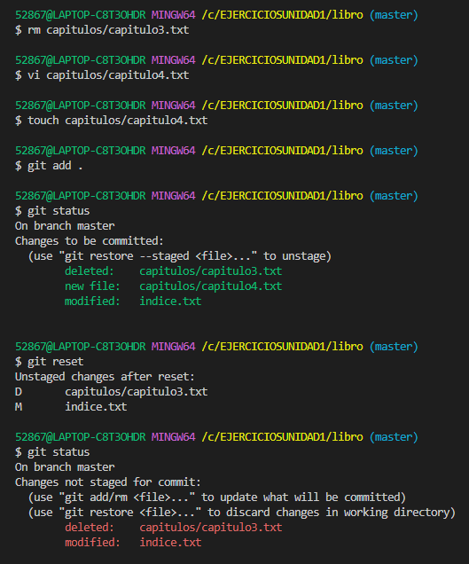<br><br>

>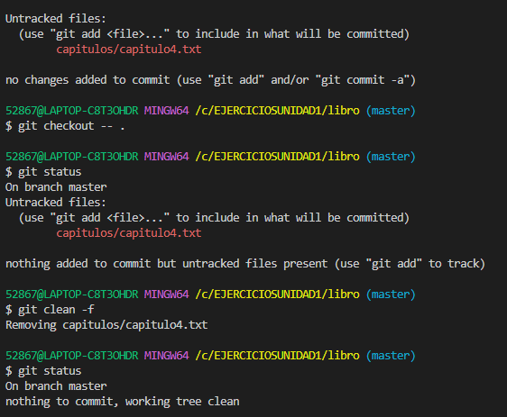<br><br>

---------

## Ejercicio 4
------------

1. Eliminar la última línea del fichero indice.txt y guardarlo.
```
 $ vi indice.txt

 $ cat indice.txt
 Capítulo 1: Introducción a Git
 Capítulo 2: Flujo de trabajo básico
 Capítulo 3: Gestión de ramas
 Capítulo 4: Repositorios remotos
```
2. Eliminar el fichero capitulos/capitulo3.txt.
```
 $ rm capitulos/capitulo3.txt
```
3. Añadir los cambios a la zona de intercambio temporal y hacer un commit con el mensaje “Borrado accidental.”
```
 $ git add .

 $ git commit -m "Borrado accidental"
```
4. Comprobar el historial del repositorio.
```
 $ git log
```
5. Deshacer el último commit pero mantener los cambios anteriores en el directorio de trabajo y la zona de intercambio temporal.
```
 $ git reset soft -- HASH
```

6. Comprobar el historial y el estado del repositorio.

```
 $ git status

 $ git log
```

7. Volver a hacer el commit con el mismo mensaje de antes.
```
 $ git commit -m "Borrado accidental"
```
8. Deshacer el último commit y los cambios anteriores del directorio de trabajo volviendo a la versión anterior del repositorio.

```
 $ git reset hard -- HASH
```
9. Comprobar de nuevo el historial y el estado del repositorio.
```
 $ git status

 $ git log
```

>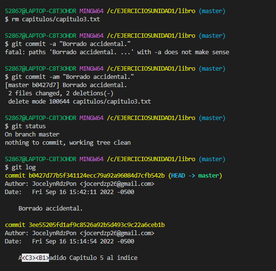<br><br>

>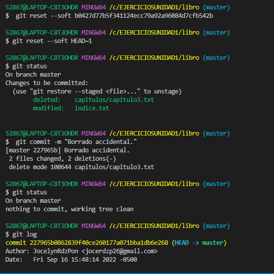<br><br>
-------------------
<br><br>
  ## **Ejercicios de gestión de ramas** <br> <br>

-------------------

## Ejercicio 1 <br>

Crear una nueva rama bibliografia y mostrar las ramas del repositorio.

```
 $ git branch bibliografia

 $ git branch -av
```
>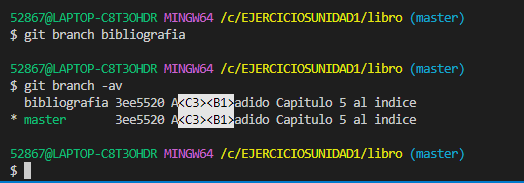<br><br>

------------
## Ejercicio 2 <br>
-----------------
1. Crear el fichero **capitulos/capitulo4.txt** y añadir el texto siguiente
    >En este capítulo veremos cómo usar GitHub para alojar repositorios en remoto.
```
 $ vi capitulos/capitulo4.txt

 $ cat capitulos/capitulo4.txt
 En este capítulo veremos cómo usar GitHub para alojar repositorios en remoto.
```
2. Añadir los cambios a la zona de intercambio temporal.
```
 $ git add .
```
3. Hacer un commit con el mensaje “Añadido capítulo 4.”

```
 $ git commit -m "Añadido capitulo 4"
```
4. Mostrar la historia del repositorio incluyendo todas las ramas.

```
 $ git log --graph --all --oneline
```
>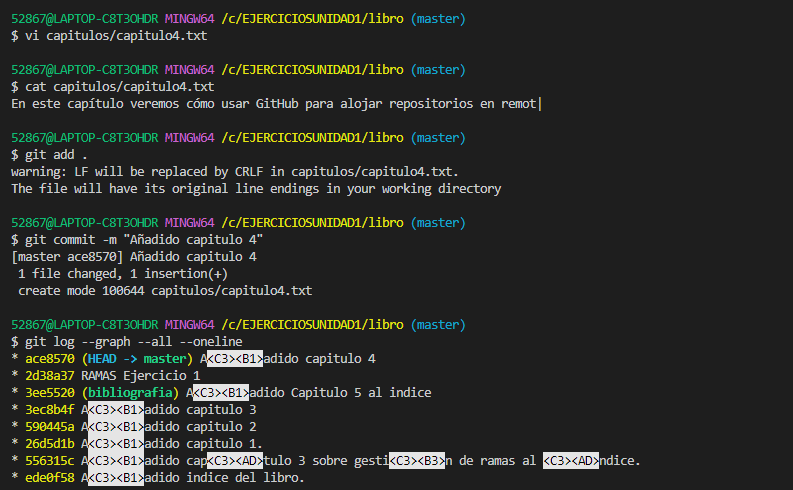<br><br>

------------------
## Ejercicio 3
--------------------

1. Cambiar a la rama bibliografia.
    ```
    $ git checkout bibliografia
    ```
2. Crear el fichero bibliografia.txt y añadir la siguiente referencia
    >Chacon, S. and Straub, B. Pro Git. Apress.
```
 $ vi bibliografia.txt

 $ cat bibliografia.txt
 Chacon, S. and Straub, B. Pro Git. Apress.
```

3. Añadir los cambios a la zona de intercambio temporal.
```
 $ git add .
```
4. Hacer un commit con el mensaje “Añadida primera referencia bibliográfica.”

```
 $ git commit -m "Añadida primera referencia bibliografica"
```

5. Mostrar la historia del repositorio incluyendo todas las ramas.
```
 $ git log --graph --all --oneline
```

>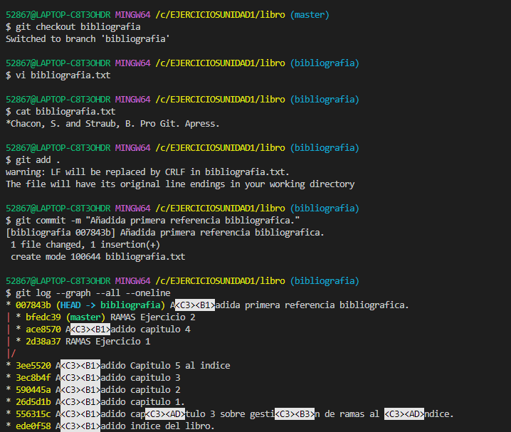<br><br>


------------------
## Ejercicio 4
--------------------

1. Fusionar la rama bibliografia con la rama master.
```
 $ git checkout master

 $ git merge bibliografia
```

2. Mostrar la historia del repositorio incluyendo todas las ramas.
```
 $ git log --graph --all --oneline
```

3. Eliminar la rama bibliografia.
```
 $ git branch -d bibliografia
```

4. Mostrar de nuevo la historia del repositorio incluyendo todas las ramas.
```
 $ git log --graph --all --oneline
```

>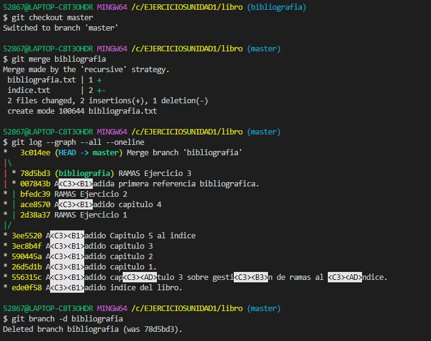<br><br>

----------------
## Ejercicio 5
-----------------
1. Crear la rama bibliografia.
```
 $ git branch bibliografia
```
2. Cambiar a la rama bibliografia.
```
 $ git checkout bibliografia
```
3. Cambiar el fichero **bibliografia.txt** para que contenga las siguientes referencias:
    >Scott Chacon and Ben Straub. Pro Git. Apress.
    Ryan Hodson. Ry’s Git Tutorial. Smashwords (2014)
```
 $ git vi bibliografia.txt

 $ git cat bibliografia.txt
 Scott Chacon and Ben Straub. Pro Git. Apress.
 Ryan Hodson. Ry’s Git Tutorial. Smashwords (2014)
```
4. Añadir los cambios a la zona de intercambio temporal y hacer un commit con el mensaje “Añadida nueva referencia bibliográfica.”
```
 $ git add .

 $ git commit -m "Añadida nueva referencia bibliografica"
```
5. Cambiar a la rama master.

```
 $ git checkout master
```
6. Cambiar el fichero bibliografia.txt para que contenga las siguientes referencias:
    >Chacon, S. and Straub, B. Pro Git. Apress.
    Loeliger, J. and McCullough, M. Version control with Git. O’Reilly.

```
 $ vi bibliografia.txt

 $ cat bibliografia.txt
Chacon, S. and Straub, B. Pro Git. Apress.
Loeliger, J. and McCullough, M. Version control with Git   O’Reilly.
```
7. Añadir los cambios a la zona de intercambio temporal y hacer un commit con el mensaje “Añadida nueva referencia bibliográfica.”
```
 $ git add .

 $ git commit -m "Añadida nueva referencia bibliografica"
```

8. Fusionar la rama bibliografia con la rama master.
```
$ git merge bibliografia
```
9. Resolver el conflicto dejando el fichero bibliografia.txt con las referencias:
    >Chacon, S. and Straub, B. Pro Git. Apress.
    Loeliger, J. and McCullough, M. Version control with Git. O’Reilly.
```
$ vi bibliografia.txt

$ cat bibliografia.txt
Chacon, S. and Straub, B. Pro Git. Apress.
Loeliger, J. and McCullough, M. Version control with Git. O’Reilly.
Hodson, R. Ry’s Git Tutorial. Smashwords (2014)
```
10. Añadir los cambios a la zona de intercambio temporal y hacer un commit con el mensaje “Resuelto conflicto de bibliografía.”
```
$ git add .

$ git commit -m "Resuelto conflicto de bibliografia"
```
11. Mostrar la historia del repositorio incluyendo todas las ramas.
```
$ git log --graph --all -oneline
```

>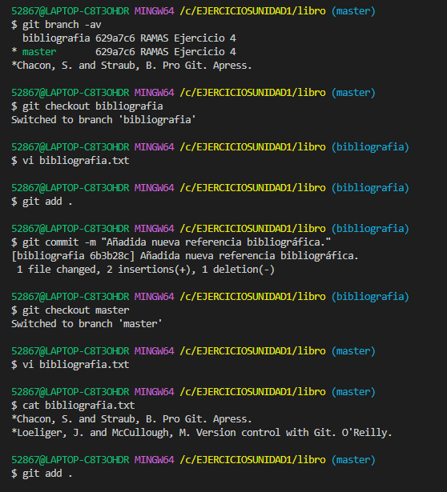<br><br>
>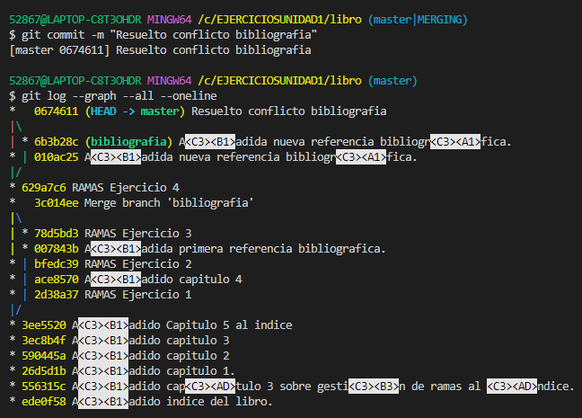<br><br>
-----------------------------
  
  # **Ejercicios de repositorios remotos** <br> <br>

## Ejercicio 1 <br>
----------------------

1. Crear un nuevo repositorio público en GitHub con el nombre libro-git.

2. Añadirlo al repositorio local del libro.
```
$ git remote add origin https://github.com/JocelynRdzPon/libro-git.git
```
3. Mostrar todos los repositorios remotos configurados.
```
$ git remote -v
```
>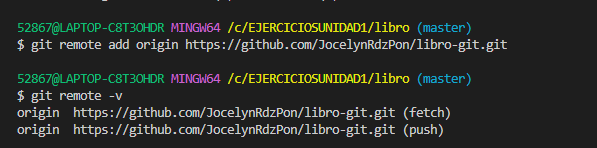<br><br>

---------------------
## Ejercicio 2 <br>
----------------------
1. Añadir los cambios del repositorio local al repositorio remoto de GitHub.
```
$ git push origin master
```
2. Acceder a GitHub y comprobar que se han subido los cambios mostrando el historial de versiones.

>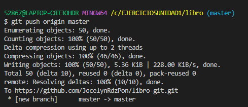<br><br>

---------------------
## Ejercicio 3 <br>
----------------------

1. Colaborar en el repositorio remoto libro-git de otro usuario.
2. Clonar su repositorio libro-git.
```
$ git clone https://github.com/AngelSalazarRochaITNL/Libro-git.git
```
3. Añadir el fichero autores.txt que contenga el nombre del usuario y su correo electrónico.
```
$ vi autores.txt

$ cat autores.txt
Jocelyn Rodriguez Ponce jocerdzp26@gmail.com
```

4. Añadir los cambios a la zona de intercambio temporal.

```
$ git add .
```
5. Hacer un commit con el mensaje “Añadido autor.”
```
$ git commit -m "Añadido autor"
```
6. Subir los cambios al repositorio remoto.
```
$ git push origin master
```
>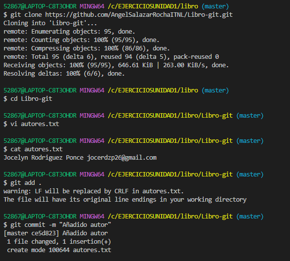<br><br>

>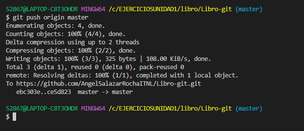<br><br>

---------------------
## Ejercicio 4 <br>
----------------------
1. Hacer una bifurcación del repositorio remoto asalber/libro-git en GitHub.


2. Clonar el repositorio creado en la cuenta de GitHub del usuario.
```
$ git clone https://github.com/JocelynRdzPon/libro-git-1.git
```
3. Crear una nueva rama autoria y activarla.
```
$ cd libro-git-1
$ git checkout -b autoria
```
4. Añadir el nombre del usuario y su correo al fichero autores.txt.
```
 $ vi autores.txt
 
 $ cat autores.txt
 Alfredo Sánchez Alberca (asalber@ceu.es)       
 Jocelyn Rodriguez Ponce (jocerdzp26@gmail.com).
```
5. Añadir los cambios a la zona de intercambio temporal.
```
$ git add .
```

6. Hacer un commit con el mensaje “Añadido nuevo autor.”
```
$ git commit -m "Añadido nuevo  autor"
```
7. Subir los cambios de la rama autoria al repositorio remoto en GitHub.
```
$ git push origin autoria
```
8. Hacer un Pull Request de los cambios en la rama autoria.

>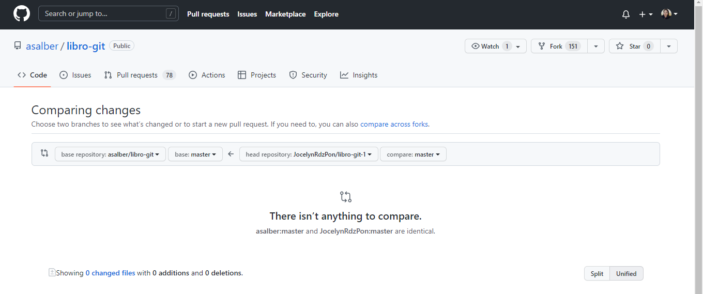<br><br>

Resultados

>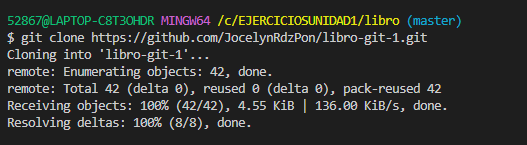<br><br>

>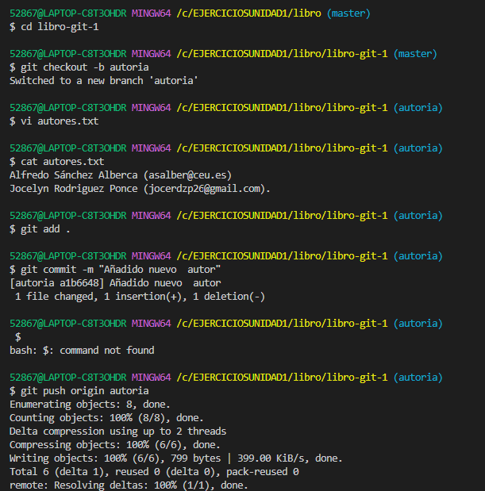<br><br>